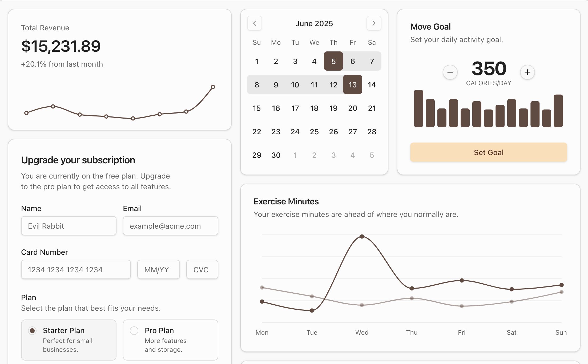

# Admin Dashboard - PERN Stack

<div align="center" style="margin: 30px;">
    
</div>

## 📋 Sobre o Projeto

Um painel administrativo completo e moderno desenvolvido com a stack **PERN** (PostgreSQL, Express.js, React, Node.js). Fornece uma interface intuitiva para gerenciar dados, usuários e recursos da aplicação com funcionalidades avançadas de autenticação, autorização e visualização de dados.

## 🚀 Stack de Tecnologia

### Frontend
- **React** - UI library
- **TypeScript** - Type safety
- **Vite** - Build tool & dev server
- **React Router** - Routing
- **Tailwind CSS** - Styling
- **shadcn/ui** - Component library
- **Refine** - Admin framework
- **Lucide React** - Icons

### Backend
- **Node.js** - Runtime
- **Express.js** - Backend framework
- **PostgreSQL** - Database
- **JWT** - Authentication

## ✨ Funcionalidades

- 🔐 Autenticação e autorização com JWT
- 📊 Dashboard com gráficos e estatísticas
- 👥 Gerenciamento de usuários
- 📚 Gerenciamento de disciplinas/subjects
- 🎨 Tema escuro/claro
- 📱 Interface responsiva
- 🔔 Sistema de notificações
- 📋 Tabelas avançadas com filtros e paginação
- ⌨️ Atalhos de teclado com Kbar
- 📱 Design mobile-first

## 📦 Instalação

### Pré-requisitos
- Node.js 18+
- npm ou yarn
- PostgreSQL

### Clone e Instalação

```bash
# Clone o repositório
git clone <seu-repositorio>
cd admin_dashboard

# Instale as dependências
npm install

# Configure as variáveis de ambiente
cp .env.example .env.local
```

## 🏃 Scripts Disponíveis

### Executar servidor de desenvolvimento
```bash
npm run dev
```
Abre [http://localhost:5173](http://localhost:5173) para visualizar no navegador.

### Build para produção
```bash
npm run build
```

### Executar servidor de produção
```bash
npm run start
```

### Lint
```bash
npm run lint
```

## 📁 Estrutura do Projeto

```
admin_dashboard/
├── src/
│   ├── components/
│   │   ├── refine-ui/          # Componentes Refine customizados
│   │   │   ├── buttons/        # Botões (Create, Edit, Delete, etc)
│   │   │   ├── data-table/     # Componentes de tabela
│   │   │   ├── form/           # Formulários (Login, SignUp, etc)
│   │   │   ├── layout/         # Layout, Header, Sidebar
│   │   │   ├── notification/   # Toaster e notificações
│   │   │   ├── theme/          # Tema e seletor de tema
│   │   │   └── views/          # Views (Create, Edit, List, Show)
│   │   └── ui/                 # Componentes shadcn/ui
│   ├── pages/
│   │   └── dashboard.tsx       # Página principal do dashboard
│   ├── hooks/                  # Custom React hooks
│   ├── lib/                    # Utilitários
│   ├── providers/              # Data providers e constantes
│   ├── App.tsx                 # Componente principal
│   └── index.tsx               # Entry point
├── public/                     # Arquivos estáticos
├── package.json
├── tsconfig.json
├── vite.config.ts
└── index.html
```

## 🔧 Configuração

Crie um arquivo `.env.local` com as seguintes variáveis:

```env
VITE_API_URL=http://localhost:3000
VITE_PROJECT_ID=Ght49F-3tRHMV-pH92MM
```

## 🎨 Temas

O dashboard suporta temas claro e escuro. Use o seletor de tema no header para alternar entre eles.

## 📚 Componentes Principais

### Layout
- **Header** - Barra superior com navegação
- **Sidebar** - Menu lateral colapsável
- **Breadcrumb** - Navegação em trilha

### Tabelas
- Filtros avançados
- Paginação
- Ordenação por colunas
- Ações em lote

### Formulários
- Validação de dados
- Feedback em tempo real
- Integração com Refine

## 🔐 Autenticação

O projeto utiliza JWT para autenticação. O token é armazenado localmente e incluído em todas as requisições à API.

## 📖 Documentação

- [Refine Docs](https://refine.dev/docs)
- [React Router Docs](https://reactrouter.com)
- [shadcn/ui Docs](https://ui.shadcn.com)
- [Tailwind CSS Docs](https://tailwindcss.com)

## 🤝 Contribuindo

Contribuições são bem-vindas! Sinta-se livre para abrir issues e pull requests.

## 📄 Licença

MIT
